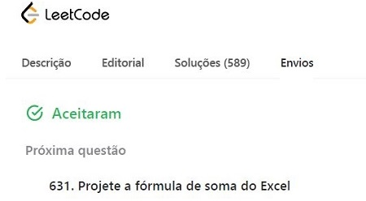
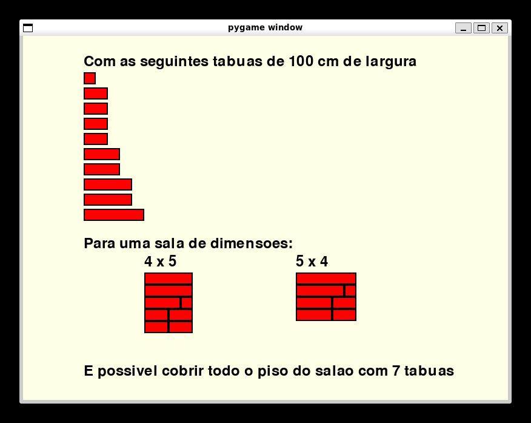

# Greed_Exercicios-Beecrowd

**Número da Lista**: 8 
**Conteúdo da Disciplina**: Greed 

## Alunos
| Matrícula | Aluno                              |
| --------- | ---------------------------------- |
| 211031664 | Catlen Cleane Ferreira de Oliveira |
| 212002907 | Zenilda Pedrosa Vieira             |

## Sobre 
Escolhemos 2 exercícios do LeetCode e 3 do Beecrowd sobre a matéria estudada. 

> Algoritmo do Caminhoneiro - Nível médio - [134 - Posto de Gasolina](134/LeetCode_134_Posto_de_Gasolina.py) 
> Algoritmo "Interval Scheduling" - Nível difícil - [630 - Cronograma do Curso III](630/LeetCode_630_Cronograma_do_Curso_III.py) 
> Algoritmo das moedas - Nível 6 - [1021 - Notas e Moedas](1021/Beecrowd_1021_Notas_e_Moedas.py) 
> Algoritmo "Scheduling to Minimize Lateness" - Nível 6 - [2115 - Produção em Ecaterimburgo](2115/Beecrowd_2115_Producao_em_Ecaterimburgo.cpp) 
> Algoritmo "Interval Partitioning" - Nível 7 - [1086 - O Salão do Clube](1086/Beecrowd_1086_O_Salão_do_Clube_com_pygame.py) 

Obs.:  

## Screenshots

 

 
 

## Vídeo explicativo

[Apresentacao_Greed.mp4](Apresentacao_Greed.mp4)

## Instalação 
**Linguagens**: Python e C++  
Quatro códigos foram feitos em Python 3.11 e um deles em C++.

Para o exercício que utiliza a biblioteca Pygame pode ser necessário instalar usando 

    pip install pygame

## Uso 
Os exemplos do Beecrowd:

Para rodar basta clonar o repositório e usar o comando no terminal (dentro da pasta do arquivo):

    python3 nome_arquivo.py < nome_arq_entradas.txt

ou (para o código em C++)
    
    g++ -o nome_arquivo nome_arquivo.cpp
    ./nome_arquivo < nome_arquivo_entrada.txt

Outra forma de verificar o código é submetê-lo ao juiz do Beecrowd:

[Beecrowd - 1021 - Notas e Moedas](https://www.beecrowd.com.br/judge/pt/problems/view/1021) 

[Beecrowd - 2115 - Produção em Ecaterimburgo](https://www.beecrowd.com.br/judge/pt/problems/view/2115) 

Os exemplos do LeetCode devem ser submetidos no juiz do site:

[LeetCode - 134 - Posto de Gasolina](https://leetcode.com/problems/gas-station/) 

[LeetCode - 630 - Cronograma do Curso III](https://leetcode.com/problems/course-schedule-iii/description/) 

Obs.: o exercicio [1086 - O Salão do Clube](1086/Beecrowd_1086_O_Salão_do_Clube_com_pygame.py) não foi submetido ao Beecrowd. 
Ao invés disso, foi criada uma tela de saída com os resultados dos exemplos dados.
    
## Outros 
Foram escolhidos um exercício de Algoritmo do Caminhoneiro, um de "Interval Scheduling", um de Algoritmo das Moedas, um de "Interval Partitioning" e um de "Scheduling to Minimize Lateness".
